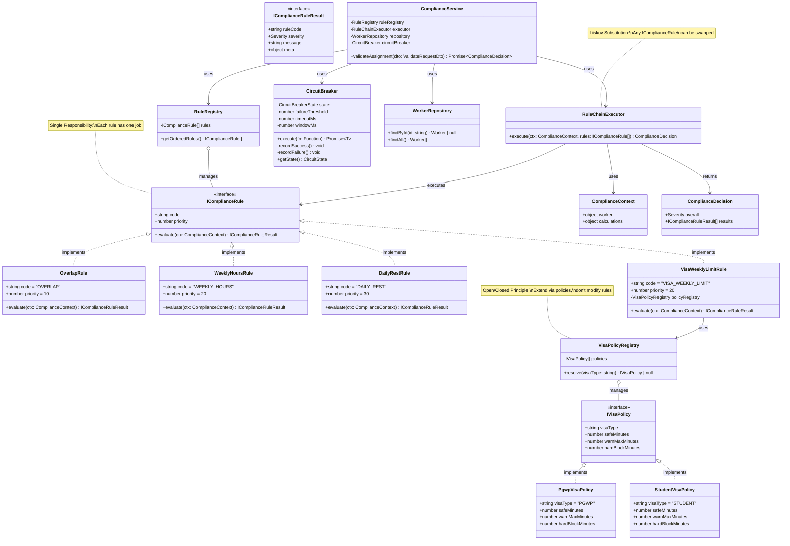
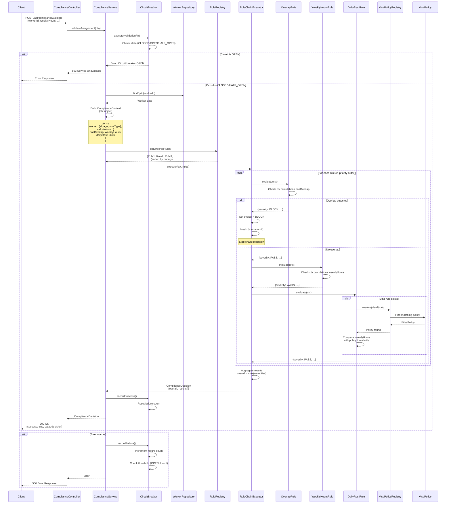

# Compliance Engine PoC - Implementation Plan

**Goal:** Build a simple, educational PoC of the compliance engine pattern in 2.5 hours  
**Tech Stack:** Bun + Express.js (simple, fast, no DB)  
**Pattern:** Chain of Responsibility + Repository Pattern (static data)

---

## 📚 Understanding the Current Compliance Engine

### Architecture Overview

```
Request → Service → RuleRegistry → RuleChainExecutor → Rules → Decision
```

**Key Components:**

1. **ComplianceEngineService**: Orchestrates validation, builds context from DTO
2. **RuleRegistry**: Manages rules, sorts by priority (lower = earlier execution)
3. **RuleChainExecutor**: Executes rules sequentially, short-circuits on BLOCK
4. **Rules**: Individual compliance checks implementing `IComplianceRule`
5. **Context (`ctx`)**: Data structure passed to rules containing worker info + pre-calculated values (e.g., weekly hours, rest periods). Acts as a shared data container that rules read from but don't modify.
6. **Decision**: Aggregated result with `overall` severity + `results[]` array

### Understanding the Context (`ctx`) Object

**What is `ctx`?**
- `ctx` stands for **"context"** - a data structure that carries all information needed for rule evaluation
- It's an immutable data container passed to each rule's `evaluate()` method
- Rules read from `ctx` but never modify it (immutability principle)

**Why is `ctx` needed?**
- **Separation of Concerns**: Rules don't fetch data themselves - they receive pre-calculated values
- **Testability**: Easy to mock/test rules by providing different `ctx` values
- **Performance**: Calculations happen once in the service, not in each rule
- **Consistency**: All rules see the same data snapshot, ensuring consistent evaluation

**Structure:**
```typescript
ctx = {
  worker: { id, age, visaType },      // Worker identity and attributes
  calculations: {                      // Pre-computed values
    hasOverlap,                        // Boolean: shift overlap detected?
    weeklyHours,                       // Number: total weekly hours
    dailyRestHours,                    // Number: hours of rest before shift
    weeklyRestHours                    // Number: max continuous rest in 7-day window
  }
}
```

### Pattern: Chain of Responsibility

- Rules execute in priority order
- Each rule evaluates context independently
- BLOCK severity stops chain execution immediately
- Overall severity: BLOCK > WARN > PASS

### Current Rules (Priority Order)

| Priority | Rule Code | Description | Severities | Stops Chain? |
|----------|-----------|-------------|------------|--------------|
| 10 | `OVERLAP` | Detects overlapping shift assignments (impossible schedules) | PASS, **BLOCK** | ✅ Yes (HARD BLOCK) |
| 15 | `VISA_EXPIRY` | Validates worker visa expiry date to ensure visa is still valid | PASS, WARN, **BLOCK** | ✅ Yes (on BLOCK) |
| 20 | `VISA_WEEKLY_LIMIT` | Enforces visa-specific weekly hour limits using policy registry pattern | PASS, WARN, **BLOCK** | ✅ Yes (on BLOCK) |
| 30 | `WTD_WEEKLY_HOURS` | Enforces Working Time Directive (WTD) weekly hour limits (UK/EU regulation) | PASS, WARN, **BLOCK** | ✅ Yes (on BLOCK) |
| 40 | `DAILY_REST_11H` | Ensures minimum 11 hours of daily rest between shifts | PASS, WARN | ❌ No |
| 50 | `WEEKLY_REST_24H` | Ensures minimum 24 hours of continuous rest within any 7-day window | PASS, WARN | ❌ No |

### Circuit Breaker Pattern

- **States**: CLOSED (normal), OPEN (failing), HALF_OPEN (testing)
- **Failure Tracking**: Count failures within time window
- **Threshold**: Open circuit after N failures
- **Recovery**: Attempt recovery after timeout period

---

## 📊 Architecture Diagrams

### Class Diagram - SOLID Principles & Relationships



### Sequence Diagram - Request Flow



---

## 🎯 PoC Requirements

### Scope (2.5 Hours)

1. **Single API Endpoint**: `POST /api/compliance/validate`
2. **3-4 Simple Rules**: Overlap, Weekly Hours, Daily Rest, Age Check (simple example)
3. **Repository Pattern**: Static hardcoded data (no DB)
4. **Circuit Breaker**: Simple in-memory implementation
5. **Clear Response**: Compliance decision with all rule results

### Tech Stack

- **Runtime**: Bun (fast, simple, TypeScript-native)
- **Framework**: Express.js (minimal setup)
- **Language**: TypeScript
- **No Dependencies**: Keep it simple, use built-ins

---

## 📁 Project Structure

```
compliance-poc/
├── src/
│   ├── types/
│   │   ├── severity.enum.ts          # PASS, WARN, BLOCK
│   │   ├── compliance-rule.interface.ts
│   │   ├── compliance-result.interface.ts
│   │   ├── compliance-decision.interface.ts
│   │   └── compliance-context.interface.ts
│   ├── rules/
│   │   ├── overlap.rule.ts           # Priority 10
│   │   ├── weekly-hours.rule.ts       # Priority 20
│   │   ├── daily-rest.rule.ts         # Priority 30
│   │   ├── visa-weekly-limit.rule.ts  # Priority 20 (extension example)
│   │   ├── weekly-rest-24h.rule.ts   # Priority 50 (extension example)
│   │   └── age-check.rule.ts         # Priority 40 (simple example)
│   ├── policies/
│   │   └── visa/
│   │       ├── i-visa-policy.interface.ts
│   │       ├── visa-policy-registry.ts
│   │       ├── pgwp-visa.policy.ts   # Canada Post-Graduation Work Permit
│   │       └── student-visa.policy.ts # Student visa (extension example)
│   ├── registry/
│   │   └── rule-registry.ts          # Manages and orders rules
│   ├── executor/
│   │   └── rule-chain-executor.ts    # Executes rules in chain
│   ├── repository/
│   │   └── worker.repository.ts      # Static data (mimics DB)
│   ├── circuit-breaker/
│   │   └── circuit-breaker.ts        # Simple in-memory circuit breaker
│   ├── service/
│   │   └── compliance.service.ts     # Main orchestration service
│   ├── dto/
│   │   └── validate-request.dto.ts   # Request DTO
│   ├── controller/
│   │   └── compliance.controller.ts  # Express route handler
│   └── app.ts                         # Express app setup
├── package.json
├── tsconfig.json
└── README.md
```

---

## 🏗️ Implementation Steps (2.5 Hours)

### Phase 1: Setup & Types (30 min)

#### Step 1.1: Initialize Project (5 min)
```bash
mkdir compliance-poc && cd compliance-poc
bun init -y
bun add express
bun add -d @types/express typescript
```

#### Step 1.2: Create Type Definitions (25 min)

**`src/types/severity.enum.ts`**
```typescript
/**
 * @title Severity Enum
 * @notice Defines severity levels for compliance rule results
 * @dev Used to indicate the severity of compliance violations
 * 
 * Severity Hierarchy: PASS < WARN < BLOCK
 * - PASS: No violation, assignment is compliant
 * - WARN: Warning violation, assignment can proceed with override
 * - BLOCK: Critical violation, assignment cannot proceed (hard block)
 * 
 * @author Compliance Engine PoC
 * @version 1.0.0
 */
export enum Severity {
  PASS = 'PASS',   // No violation, compliant
  WARN = 'WARN',   // Warning, override allowed
  BLOCK = 'BLOCK' // Critical violation, hard block
}
```

**`src/types/compliance-rule.interface.ts`**
```typescript
/**
 * @title Compliance Rule Interface
 * @notice Contract that all compliance rules must implement
 * @dev Defines the structure for Chain of Responsibility pattern handlers
 * 
 * Purpose:
 * - Ensures all rules follow the same contract
 * - Enables polymorphism: any rule can be swapped with another
 * - Supports SOLID principles (Liskov Substitution, Dependency Inversion)
 * 
 * @author Compliance Engine PoC
 * @version 1.0.0
 */

import { IComplianceRuleResult } from './compliance-result.interface'
import { ComplianceContext } from './compliance-context.interface'

export interface IComplianceRule {
  /**
   * @notice Unique identifier for the rule
   * @dev Used in results, logging, and debugging
   * @example "OVERLAP", "WEEKLY_HOURS", "DAILY_REST"
   */
  code: string
  
  /**
   * @notice Execution priority (lower = earlier)
   * @dev Determines order of rule execution
   *      Lower numbers execute first (e.g., 10 before 20)
   * @example 10, 20, 30
   */
  priority: number
  
  /**
   * @notice Evaluate rule against compliance context
   * @dev Core method that performs the compliance check
   * 
   * @param ctx - ComplianceContext containing worker info and calculations
   *              Rules read from ctx but never modify it
   * 
   * @return IComplianceRuleResult with severity and message
   * 
   * @example
   * const result = rule.evaluate(ctx)
   * // Returns: { ruleCode: "OVERLAP", severity: Severity.BLOCK, ... }
   */
  evaluate(ctx: ComplianceContext): IComplianceRuleResult
}
```

**`src/types/compliance-result.interface.ts`**
```typescript
/**
 * @title Compliance Rule Result Interface
 * @notice Result returned by a single rule evaluation
 * @dev Contains the outcome of one rule's compliance check
 * 
 * @author Compliance Engine PoC
 * @version 1.0.0
 */

import { Severity } from './severity.enum'

export interface IComplianceRuleResult {
  /**
   * @notice Rule code that produced this result
   * @dev Matches the rule's code property
   */
  ruleCode: string
  
  /**
   * @notice Severity level of the result
   * @dev PASS, WARN, or BLOCK
   */
  severity: Severity
  
  /**
   * @notice Human-readable message describing the result
   * @dev Used for logging, UI display, and debugging
   */
  message: string
  
  /**
   * @notice Optional metadata for additional context
   * @dev Contains rule-specific data (thresholds, values, etc.)
   *      Useful for debugging and audit trails
   */
  meta?: Record<string, any>
}
```

**`src/types/compliance-decision.interface.ts`**
```typescript
/**
 * @title Compliance Decision Interface
 * @notice Final aggregated result after all rule evaluations
 * @dev Contains overall severity and individual rule results
 * 
 * Purpose:
 * - Aggregates results from all executed rules
 * - Provides overall severity (BLOCK > WARN > PASS)
 * - Contains detailed results for each rule
 * 
 * @author Compliance Engine PoC
 * @version 1.0.0
 */

import { Severity } from './severity.enum'
import { IComplianceRuleResult } from './compliance-result.interface'

export interface IComplianceDecision {
  /**
   * @notice Overall severity after aggregating all rule results
   * @dev Highest severity encountered: BLOCK > WARN > PASS
   *      If any rule returns BLOCK, overall is BLOCK
   *      If any rule returns WARN, overall is WARN (unless BLOCK exists)
   *      Otherwise, overall is PASS
   */
  overall: Severity
  
  /**
   * @notice Array of results from each executed rule
   * @dev May be partial if chain was short-circuited on BLOCK
   *      Results are in execution order (priority order)
   */
  results: IComplianceRuleResult[]
}
```

**`src/types/compliance-context.interface.ts`**
```typescript
/**
 * @title Compliance Context Interface
 * @notice Shared data container passed to all compliance rules
 * @dev Immutable data structure that rules read from but never modify
 * 
 * Purpose:
 * - Provides all data needed for rule evaluation in one place
 * - Ensures consistency: all rules see the same data snapshot
 * - Enables testability: easy to mock different scenarios
 * - Separates concerns: rules don't fetch data, they receive it
 * 
 * Structure:
 * - worker: Worker identity and attributes (id, age, visaType)
 * - calculations: Pre-computed values (overlap, hours, rest periods)
 * 
 * @author Compliance Engine PoC
 * @version 1.0.0
 */

export interface ComplianceContext {
  /**
   * @notice Worker information and attributes
   * @dev Contains worker identity and optional attributes used by rules
   */
  worker: {
    id: string              // Worker unique identifier (required)
    age?: number           // Worker age (optional, used by age check rule)
    visaType?: string      // Visa type code (optional, used by visa rules)
  }
  
  /**
   * @notice Pre-calculated values for rule evaluation
   * @dev All calculations happen once in the service, not in each rule
   *      This improves performance and ensures consistency
   */
  calculations: {
    hasOverlap: boolean          // True if shift overlaps with existing assignments
    weeklyHours: number          // Total weekly hours including current shift
    dailyRestHours: number       // Hours of rest before current shift starts
    weeklyRestHours?: number    // Maximum continuous rest in 7-day window (optional)
  }
}
```

**`src/dto/validate-request.dto.ts`**
```typescript
export interface ValidateRequestDto {
  workerId: string
  age?: number
  visaType?: string // For visa compliance rules
  hasOverlap?: boolean
  weeklyHours?: number
  dailyRestHours?: number
  weeklyRestHours?: number // For weekly rest rule (extension)
}
```

---

### Phase 2: Core Components (60 min)

#### Step 2.1: Rule Registry (15 min)

**`src/registry/rule-registry.ts`**
```typescript
/**
 * @title Rule Registry
 * @notice Manages and orders compliance rules
 * @dev Central registry for all compliance rules with deterministic ordering
 * 
 * Responsibilities:
 * - Stores all compliance rules
 * - Sorts rules by priority (lower priority = earlier execution)
 * - Provides deterministic ordering for consistent behavior
 * 
 * Sorting Strategy:
 * 1. Primary: Priority (ascending) - lower numbers execute first
 * 2. Secondary: Code (alphabetical) - ensures deterministic ordering when priorities match
 * 
 * @author Compliance Engine PoC
 * @version 1.0.0
 */

import { IComplianceRule } from '../types/compliance-rule.interface'

export class RuleRegistry {
  /**
   * @notice Constructor
   * @param rules - Array of compliance rules to manage
   */
  constructor(private rules: IComplianceRule[]) {}

  /**
   * @notice Get rules sorted by priority
   * @dev Returns a new array (doesn't modify original) sorted by priority then code
   * 
   * @return Array of rules sorted by priority (ascending), then alphabetically by code
   * 
   * @example
   * const registry = new RuleRegistry([rule1, rule2, rule3])
   * const ordered = registry.getOrderedRules()
   * // Returns: [rule with priority 10, rule with priority 20, ...]
   */
  getOrderedRules(): IComplianceRule[] {
    // Create a copy of rules array to avoid mutating original
    return [...this.rules].sort((a, b) => {
      // Primary sort: priority (ascending)
      // Lower priority numbers execute first (e.g., 10 before 20)
      if (a.priority !== b.priority) {
        return a.priority - b.priority
      }
      
      // Secondary sort: code (alphabetical)
      // Ensures deterministic ordering when priorities are equal
      // Example: If two rules have priority 20, they're ordered by code
      return a.code.localeCompare(b.code)
    })
  }
}
```

#### Step 2.2: Rule Chain Executor (15 min)

**`src/executor/rule-chain-executor.ts`**
```typescript
/**
 * @title Rule Chain Executor
 * @notice Core component of Chain of Responsibility pattern
 * @dev Executes compliance rules sequentially in priority order
 * 
 * Responsibilities:
 * - Iterates through rules in priority order (lowest first)
 * - Executes each rule's evaluate() method with the shared context
 * - Aggregates results from all executed rules
 * - Implements short-circuit logic: stops execution on BLOCK severity
 * - Determines overall severity: BLOCK > WARN > PASS
 * 
 * Chain of Responsibility Pattern:
 * - Each rule is a handler in the chain
 * - Rules are independent and don't know about each other
 * - Executor coordinates the chain execution
 * - Short-circuit prevents unnecessary rule evaluation
 * 
 * @author Compliance Engine PoC
 * @version 1.0.0
 */

import { IComplianceRule } from '../types/compliance-rule.interface'
import { IComplianceRuleResult } from '../types/compliance-result.interface'
import { IComplianceDecision } from '../types/compliance-decision.interface'
import { ComplianceContext } from '../types/compliance-context.interface'
import { Severity } from '../types/severity.enum'

export class RuleChainExecutor {
  /**
   * @notice Executes rules sequentially in priority order
   * @dev Implements Chain of Responsibility pattern with short-circuit on BLOCK
   * 
   * @param ctx - ComplianceContext object containing worker info and pre-calculated values
   *              This is the shared data container that all rules read from
   * @param rules - Array of IComplianceRule instances, already sorted by priority
   *                Lower priority numbers execute first
   * 
   * @return ComplianceDecision object containing:
   *         - overall: Highest severity encountered (BLOCK > WARN > PASS)
   *         - results: Array of individual rule results (may be partial if short-circuited)
   * 
   * @example
   * const executor = new RuleChainExecutor()
   * const decision = executor.execute(ctx, [overlapRule, weeklyHoursRule])
   * // If overlapRule returns BLOCK, weeklyHoursRule is never executed
   */
  execute(ctx: ComplianceContext, rules: IComplianceRule[]): IComplianceDecision {
    // Array to collect results from each rule evaluation
    const results: IComplianceRuleResult[] = []
    
    // Overall severity starts at PASS (lowest), gets upgraded as rules evaluate
    // Severity hierarchy: PASS < WARN < BLOCK
    let overall = Severity.PASS

    // Iterate through rules in priority order (already sorted by RuleRegistry)
    for (const rule of rules) {
      // Execute rule's evaluate method with shared context
      // Each rule reads from ctx but never modifies it (immutability)
      const result = rule.evaluate(ctx)
      
      // Collect result for final decision
      results.push(result)

      // Short-circuit logic: BLOCK severity stops chain execution immediately
      // This prevents unnecessary rule evaluation when a hard block is detected
      // Example: If overlap is detected, we don't need to check hours/rest
      if (result.severity === Severity.BLOCK) {
        overall = Severity.BLOCK
        break // Exit loop - no more rules will be evaluated
      } 
      // Upgrade overall severity if WARN is encountered
      // Note: Once overall is WARN, it stays WARN unless BLOCK is found
      else if (result.severity === Severity.WARN) {
        overall = Severity.WARN
        // Continue to next rule (WARN doesn't stop the chain)
      }
      // If PASS, continue to next rule (overall remains unchanged or upgrades)
    }

    // Return aggregated decision with overall severity and all rule results
    return { overall, results }
  }
}
```

#### Step 2.3: Repository (Static Data) (15 min)

**`src/repository/worker.repository.ts`**
```typescript
// Static hardcoded data (mimics DB)
const WORKERS = {
  'worker-001': { id: 'worker-001', name: 'John Doe', age: 25 },
  'worker-002': { id: 'worker-002', name: 'Jane Smith', age: 18 },
  'worker-003': { id: 'worker-003', name: 'Bob Johnson', age: 35 },
}

export class WorkerRepository {
  findById(id: string) {
    return WORKERS[id] || null
  }

  findAll() {
    return Object.values(WORKERS)
  }
}
```

#### Step 2.4: Circuit Breaker (15 min)

**`src/circuit-breaker/circuit-breaker.ts`**
```typescript
/**
 * @title Circuit Breaker
 * @notice Protects service from cascading failures
 * @dev Implements circuit breaker pattern to prevent service overload
 * 
 * Purpose:
 * - Prevents cascading failures when downstream services are failing
 * - Provides automatic recovery mechanism after failures
 * - Reduces load on failing services by quickly rejecting requests
 * 
 * States:
 * - CLOSED: Normal operation, requests pass through
 * - OPEN: Circuit is open, requests are rejected immediately
 * - HALF_OPEN: Testing state, allows limited requests to test recovery
 * 
 * How it works:
 * 1. Count failures within a time window
 * 2. Open circuit when failure threshold is reached
 * 3. After timeout, transition to HALF_OPEN to test recovery
 * 4. Close circuit if test succeeds, reopen if it fails
 * 
 * @author Compliance Engine PoC
 * @version 1.0.0
 */

/**
 * @notice Circuit breaker states
 * @dev CLOSED = normal, OPEN = failing, HALF_OPEN = testing recovery
 */
type CircuitState = 'CLOSED' | 'OPEN' | 'HALF_OPEN'

/**
 * @notice Internal state tracking for circuit breaker
 * @dev Tracks failure count, timing, and current state
 */
interface CircuitBreakerState {
  failures: number        // Count of failures in current window
  lastFailureTime: number  // Timestamp of last failure (for window calculation)
  state: CircuitState      // Current circuit state
}

export class CircuitBreaker {
  /**
   * @notice Internal state of the circuit breaker
   * @dev Initialized to CLOSED state (normal operation)
   */
  private state: CircuitBreakerState = {
    failures: 0,
    lastFailureTime: 0,
    state: 'CLOSED'
  }

  /**
   * @notice Constructor for CircuitBreaker
   * @param failureThreshold - Number of failures before opening circuit (default: 5)
   * @param timeoutMs - Milliseconds to wait before attempting recovery (default: 60000 = 1 min)
   * @param windowMs - Time window in milliseconds for counting failures (default: 60000 = 1 min)
   */
  constructor(
    private failureThreshold = 5,      // Open circuit after 5 failures
    private timeoutMs = 60000,          // Wait 1 minute before testing recovery
    private windowMs = 60000            // Count failures within 1 minute window
  ) {}

  /**
   * @notice Execute a function with circuit breaker protection
   * @dev Wraps function execution with circuit breaker logic
   * 
   * @param fn - Async function to execute
   * @return Promise resolving to function result
   * @throws Error if circuit is OPEN and timeout hasn't elapsed
   * 
   * Flow:
   * 1. Check circuit state
   * 2. If OPEN: Check if timeout elapsed → transition to HALF_OPEN or reject
   * 3. Execute function
   * 4. Record success/failure and update state
   * 
   * @example
   * const cb = new CircuitBreaker()
   * const result = await cb.execute(async () => {
   *   return await someService.call()
   * })
   */
  async execute<T>(fn: () => Promise<T>): Promise<T> {
    // If circuit is OPEN, check if we should attempt recovery
    if (this.state.state === 'OPEN') {
      const timeSinceLastFailure = Date.now() - this.state.lastFailureTime
      
      // If timeout has elapsed, transition to HALF_OPEN (test recovery)
      if (timeSinceLastFailure > this.timeoutMs) {
        this.state.state = 'HALF_OPEN'
      } else {
        // Circuit is still open, reject request immediately
        throw new Error('Circuit breaker is OPEN')
      }
    }

    try {
      // Execute the protected function
      const result = await fn()
      
      // Success: reset failure count and close circuit
      this.recordSuccess()
      return result
    } catch (error) {
      // Failure: increment count and potentially open circuit
      this.recordFailure()
      throw error // Re-throw to caller
    }
  }

  /**
   * @notice Record a successful execution
   * @dev Resets failure count and closes circuit
   * @dev Called internally after successful function execution
   */
  private recordSuccess() {
    // Reset failure tracking
    this.state.failures = 0
    this.state.state = 'CLOSED' // Circuit is healthy again
  }

  /**
   * @notice Record a failed execution
   * @dev Increments failure count and opens circuit if threshold reached
   * @dev Called internally after failed function execution
   */
  private recordFailure() {
    const now = Date.now()
    
    // Reset failure count if we're outside the time window
    // This allows the circuit to recover naturally if failures stop
    if (now - this.state.lastFailureTime > this.windowMs) {
      this.state.failures = 0
    }

    // Increment failure count and update timestamp
    this.state.failures++
    this.state.lastFailureTime = now

    // Open circuit if failure threshold is reached
    if (this.state.failures >= this.failureThreshold) {
      this.state.state = 'OPEN'
    } 
    // If we're in HALF_OPEN state and get a failure, go back to OPEN
    // This means recovery attempt failed
    else if (this.state.state === 'HALF_OPEN') {
      this.state.state = 'OPEN'
    }
  }

  /**
   * @notice Get current circuit breaker state
   * @return Current state (CLOSED, OPEN, or HALF_OPEN)
   * @dev Useful for monitoring and debugging
   */
  getState(): CircuitState {
    return this.state.state
  }
}
```

---

### Phase 3: Rules Implementation (45 min)

#### Step 3.1: Overlap Rule (10 min)

**`src/rules/overlap.rule.ts`**
```typescript
/**
 * @title Overlap Rule
 * @notice Detects overlapping shift assignments (impossible schedules)
 * @dev Highest priority rule that blocks assignments with time conflicts
 * 
 * Purpose:
 * - Prevents double-booking of workers
 * - Ensures workers cannot be assigned to overlapping shifts
 * - Hard block: Cannot be overridden (impossible schedule)
 * 
 * Priority: 10 (highest - executes first)
 * - Must run before other rules because overlap makes other checks meaningless
 * - Short-circuits chain on BLOCK (stops other rules from executing)
 * 
 * @author Compliance Engine PoC
 * @version 1.0.0
 */

import { IComplianceRule } from '../types/compliance-rule.interface'
import { IComplianceRuleResult } from '../types/compliance-result.interface'
import { ComplianceContext } from '../types/compliance-context.interface'
import { Severity } from '../types/severity.enum'

export class OverlapRule implements IComplianceRule {
  /**
   * @notice Unique identifier for this rule
   * @dev Used in results and logging
   */
  readonly code = 'OVERLAP'
  
  /**
   * @notice Execution priority (lower = earlier)
   * @dev Priority 10 means this runs before all other rules
   */
  readonly priority = 10

  /**
   * @notice Evaluate overlap detection
   * @dev Checks if proposed shift overlaps with existing assignments
   * 
   * @param ctx - ComplianceContext containing worker info and calculations
   *              Reads ctx.calculations.hasOverlap (boolean)
   * 
   * @return IComplianceRuleResult with:
   *         - BLOCK if overlap detected (hard block, stops chain)
   *         - PASS if no overlap or data unavailable
   * 
   * Logic:
   * 1. Extract hasOverlap from context
   * 2. If data missing → PASS (safe fallback, don't block on missing data)
   * 3. If overlap detected → BLOCK (hard stop)
   * 4. If no overlap → PASS
   * 
   * @example
   * const rule = new OverlapRule()
   * const ctx = { calculations: { hasOverlap: true } }
   * const result = rule.evaluate(ctx)
   * // Returns: { severity: BLOCK, message: "Overlapping shift detected..." }
   */
  evaluate(ctx: ComplianceContext): IComplianceRuleResult {
    // Extract overlap flag from context
    // This boolean is pre-calculated by the service before rule evaluation
    const hasOverlap = ctx.calculations.hasOverlap

    // Safe fallback: if overlap data not provided, PASS without blocking
    // This prevents false blocks when data is unavailable
    // Principle: Missing data should not cause blocks
    if (hasOverlap === undefined || hasOverlap === null) {
      return {
        ruleCode: this.code,
        severity: Severity.PASS,
        message: 'Overlap data not provided',
        meta: { reason: 'Data not available' }
      }
    }

    // Hard block: Overlapping shifts are impossible schedules
    // This is a critical violation that cannot be overridden
    if (hasOverlap) {
      return {
        ruleCode: this.code,
        severity: Severity.BLOCK,
        message: 'Overlapping shift detected (hard block)',
        meta: { 
          hasOverlap: true, 
          thresholdType: 'BLOCK' 
        }
      }
    }

    // No overlap detected - assignment is valid from this rule's perspective
    return {
      ruleCode: this.code,
      severity: Severity.PASS,
      message: 'No overlapping shifts detected',
      meta: { 
        hasOverlap: false, 
        thresholdType: 'PASS' 
      }
    }
  }
}
```

#### Step 3.2: Weekly Hours Rule (10 min)

**`src/rules/weekly-hours.rule.ts`**
```typescript
/**
 * @title Weekly Hours Rule
 * @notice Enforces weekly working hour limits
 * @dev Checks total weekly hours against thresholds (PASS/WARN/BLOCK)
 * 
 * Purpose:
 * - Ensures workers don't exceed safe weekly hour limits
 * - Provides warnings before hard blocks
 * - Protects worker health and safety
 * 
 * Priority: 20 (runs after overlap check)
 * Thresholds:
 * - <= 40h: PASS (safe zone)
 * - 41-48h: WARN (warning zone, override allowed)
 * - 49-55h: WARN (high warning zone, override allowed)
 * - > 55h: BLOCK (critical zone, hard block)
 * 
 * @author Compliance Engine PoC
 * @version 1.0.0
 */

import { IComplianceRule } from '../types/compliance-rule.interface'
import { IComplianceRuleResult } from '../types/compliance-result.interface'
import { ComplianceContext } from '../types/compliance-context.interface'
import { Severity } from '../types/severity.enum'

export class WeeklyHoursRule implements IComplianceRule {
  readonly code = 'WEEKLY_HOURS'
  readonly priority = 20

  // Threshold constants (in hours)
  // These define the boundaries for PASS/WARN/BLOCK decisions
  private readonly PASS_MAX_HOURS = 40    // Safe zone: <= 40h
  private readonly WARN_MAX_HOURS = 48   // Warning zone: 41-48h
  private readonly BLOCK_MAX_HOURS = 55  // Critical zone: > 55h

  /**
   * @notice Evaluate weekly hours compliance
   * @dev Compares weekly hours against thresholds
   * 
   * @param ctx - ComplianceContext containing calculations
   *              Reads ctx.calculations.weeklyHours (number)
   * 
   * @return IComplianceRuleResult with severity based on thresholds
   * 
   * Logic Flow:
   * 1. Extract weeklyHours from context (defaults to 0 if missing)
   * 2. Compare against thresholds in order (PASS → WARN → BLOCK)
   * 3. Return appropriate severity with descriptive message
   * 
   * @example
   * const rule = new WeeklyHoursRule()
   * const ctx = { calculations: { weeklyHours: 45 } }
   * const result = rule.evaluate(ctx)
   * // Returns: { severity: WARN, message: "Weekly hours in warning zone: 45h..." }
   */
  evaluate(ctx: ComplianceContext): IComplianceRuleResult {
    // Extract weekly hours from context
    // Uses nullish coalescing (??) to default to 0 if undefined/null
    // This ensures we always have a number to compare
    const weeklyHours = ctx.calculations.weeklyHours ?? 0

    // Green zone: Hours within safe limit
    if (weeklyHours <= this.PASS_MAX_HOURS) {
      return {
        ruleCode: this.code,
        severity: Severity.PASS,
        message: `Weekly hours within safe limit: ${weeklyHours}h (threshold: ${this.PASS_MAX_HOURS}h)`,
        meta: { 
          weeklyHours, 
          thresholdType: 'PASS' 
        }
      }
    }

    // Amber zone: Hours approaching limit (soft warning)
    if (weeklyHours <= this.WARN_MAX_HOURS) {
      return {
        ruleCode: this.code,
        severity: Severity.WARN,
        message: `Weekly hours in warning zone: ${weeklyHours}h (threshold: ${this.WARN_MAX_HOURS}h)`,
        meta: { 
          weeklyHours, 
          thresholdType: 'WARN' 
        }
      }
    }

    // Red zone: Hours in high warning range (still override-able)
    if (weeklyHours <= this.BLOCK_MAX_HOURS) {
      return {
        ruleCode: this.code,
        severity: Severity.WARN,
        message: `Weekly hours in high warning zone: ${weeklyHours}h (threshold: ${this.BLOCK_MAX_HOURS}h)`,
        meta: { 
          weeklyHours, 
          thresholdType: 'HIGH_WARN' 
        }
      }
    }

    // Critical zone: Hours exceeded hard block threshold
    // Calculate excess hours for informative message
    const excessHours = weeklyHours - this.BLOCK_MAX_HOURS
    return {
      ruleCode: this.code,
      severity: Severity.BLOCK,
      message: `Weekly hours exceeded critical threshold: ${weeklyHours}h > ${this.BLOCK_MAX_HOURS}h (excess: ${excessHours}h)`,
      meta: { 
        weeklyHours, 
        excessHours, 
        thresholdType: 'BLOCK' 
      }
    }
  }
}
```

#### Step 3.3: Daily Rest Rule (10 min)

**`src/rules/daily-rest.rule.ts`**
```typescript
/**
 * @title Daily Rest Rule
 * @notice Ensures minimum daily rest period between shifts
 * @dev Checks that workers have sufficient rest before starting a new shift
 * 
 * Purpose:
 * - Protects worker health by ensuring adequate rest
 * - Prevents fatigue-related safety issues
 * - Compliance with labor regulations (typically 11 hours minimum)
 * 
 * Priority: 30 (runs after critical checks like overlap and hours)
 * - WARN only: Does not block assignments (override allowed)
 * - Threshold: 11 hours minimum rest required
 * 
 * @author Compliance Engine PoC
 * @version 1.0.0
 */

import { IComplianceRule } from '../types/compliance-rule.interface'
import { IComplianceRuleResult } from '../types/compliance-result.interface'
import { ComplianceContext } from '../types/compliance-context.interface'
import { Severity } from '../types/severity.enum'

export class DailyRestRule implements IComplianceRule {
  readonly code = 'DAILY_REST'
  readonly priority = 30

  /**
   * @notice Minimum required rest hours between shifts
   * @dev Standard labor regulation: 11 hours minimum daily rest
   */
  private readonly REQUIRED_REST_HOURS = 11

  /**
   * @notice Evaluate daily rest compliance
   * @dev Compares rest hours against required minimum
   * 
   * @param ctx - ComplianceContext containing calculations
   *              Reads ctx.calculations.dailyRestHours (number)
   * 
   * @return IComplianceRuleResult with:
   *         - PASS if rest >= 11 hours
   *         - WARN if rest < 11 hours (override allowed)
   *         - PASS if data unavailable (safe fallback)
   * 
   * @example
   * const rule = new DailyRestRule()
   * const ctx = { calculations: { dailyRestHours: 10 } }
   * const result = rule.evaluate(ctx)
   * // Returns: { severity: WARN, message: "Daily rest insufficient: 10h < 11h..." }
   */
  evaluate(ctx: ComplianceContext): IComplianceRuleResult {
    // Extract daily rest hours from context
    // This is the time between end of last shift and start of current shift
    const restHours = ctx.calculations.dailyRestHours

    // Safe fallback: if rest data not provided, PASS without blocking
    // Missing data should not cause warnings or blocks
    if (restHours === undefined || restHours === null) {
      return {
        ruleCode: this.code,
        severity: Severity.PASS,
        message: 'Daily rest data not provided',
        meta: { reason: 'Data not available' }
      }
    }

    // Sufficient rest: meets or exceeds required minimum
    if (restHours >= this.REQUIRED_REST_HOURS) {
      return {
        ruleCode: this.code,
        severity: Severity.PASS,
        message: `Daily rest sufficient: ${restHours}h (required: ${this.REQUIRED_REST_HOURS}h)`,
        meta: { 
          restHours, 
          requiredHours: this.REQUIRED_REST_HOURS, 
          thresholdType: 'PASS' 
        }
      }
    }

    // Insufficient rest: below required minimum
    // Returns WARN (not BLOCK) because this can be overridden if needed
    return {
      ruleCode: this.code,
      severity: Severity.WARN,
      message: `Daily rest insufficient: ${restHours}h < ${this.REQUIRED_REST_HOURS}h (required: ${this.REQUIRED_REST_HOURS}h)`,
      meta: { 
        restHours, 
        requiredHours: this.REQUIRED_REST_HOURS, 
        thresholdType: 'WARN' 
      }
    }
  }
}
```

#### Step 3.4: Age Check Rule (Simple Example) (15 min)

**`src/rules/age-check.rule.ts`**
```typescript
import { IComplianceRule } from '../types/compliance-rule.interface'
import { IComplianceRuleResult } from '../types/compliance-result.interface'
import { ComplianceContext } from '../types/compliance-context.interface'
import { Severity } from '../types/severity.enum'

export class AgeCheckRule implements IComplianceRule {
  readonly code = 'AGE_CHECK'
  readonly priority = 40

  private readonly MIN_AGE = 18

  evaluate(ctx: ComplianceContext): IComplianceRuleResult {
    const age = ctx.worker.age

    if (age === undefined || age === null) {
      return {
        ruleCode: this.code,
        severity: Severity.PASS,
        message: 'Age data not provided',
        meta: { reason: 'Data not available' }
      }
    }

    if (age < this.MIN_AGE) {
      return {
        ruleCode: this.code,
        severity: Severity.BLOCK,
        message: `Worker age ${age} is below minimum required age ${this.MIN_AGE}`,
        meta: { age, minAge: this.MIN_AGE, thresholdType: 'BLOCK' }
      }
    }

    return {
      ruleCode: this.code,
      severity: Severity.PASS,
      message: `Worker age ${age} meets minimum requirement`,
      meta: { age, minAge: this.MIN_AGE, thresholdType: 'PASS' }
    }
  }
}
```

---

### Phase 4: Service & Controller (30 min)

#### Step 4.1: Compliance Service (20 min)

**`src/service/compliance.service.ts`**
```typescript
/**
 * @title Compliance Service
 * @notice Main orchestration service for compliance validation
 * @dev Coordinates all components to validate worker assignments
 * 
 * Responsibilities:
 * - Orchestrates the compliance validation flow
 * - Builds ComplianceContext from request DTO
 * - Fetches worker data from repository
 * - Coordinates rule registry and executor
 * - Protects service with circuit breaker
 * 
 * Flow:
 * 1. Receive validation request (DTO)
 * 2. Fetch worker data
 * 3. Build context object (ctx)
 * 4. Get ordered rules from registry
 * 5. Execute rules through chain executor
 * 6. Return compliance decision
 * 
 * @author Compliance Engine PoC
 * @version 1.0.0
 */

import { RuleRegistry } from '../registry/rule-registry'
import { RuleChainExecutor } from '../executor/rule-chain-executor'
import { WorkerRepository } from '../repository/worker.repository'
import { CircuitBreaker } from '../circuit-breaker/circuit-breaker'
import { ValidateRequestDto } from '../dto/validate-request.dto'
import { IComplianceDecision } from '../types/compliance-decision.interface'
import { ComplianceContext } from '../types/compliance-context.interface'

export class ComplianceService {
  /**
   * @notice Circuit breaker instance for service protection
   * @dev Protects against cascading failures
   */
  private circuitBreaker: CircuitBreaker

  /**
   * @notice Constructor with dependency injection
   * @param ruleRegistry - Registry managing all compliance rules
   * @param ruleChainExecutor - Executor for running rule chain
   * @param workerRepository - Repository for worker data access
   */
  constructor(
    private ruleRegistry: RuleRegistry,
    private ruleChainExecutor: RuleChainExecutor,
    private workerRepository: WorkerRepository
  ) {
    // Initialize circuit breaker with defaults:
    // - 5 failures threshold
    // - 60 second timeout
    // - 60 second failure window
    this.circuitBreaker = new CircuitBreaker(5, 60000, 60000)
  }

  /**
   * @notice Validate a worker assignment against compliance rules
   * @dev Main entry point for compliance validation
   * 
   * @param dto - ValidateRequestDto containing:
   *              - workerId: Worker identifier
   *              - age, visaType: Optional worker attributes
   *              - hasOverlap, weeklyHours, dailyRestHours, weeklyRestHours: Pre-calculated values
   * 
   * @return Promise resolving to IComplianceDecision with overall severity and rule results
   * 
   * Process:
   * 1. Wrap execution in circuit breaker for protection
   * 2. Fetch worker data from repository
   * 3. Build ComplianceContext (ctx) from DTO and worker data
   * 4. Get ordered rules from registry
   * 5. Execute rules through chain executor
   * 6. Return aggregated decision
   * 
   * @throws Error if worker not found or circuit breaker is OPEN
   * 
   * @example
   * const service = new ComplianceService(registry, executor, repository)
   * const decision = await service.validateAssignment({
   *   workerId: 'worker-001',
   *   weeklyHours: 45,
   *   hasOverlap: false
   * })
   */
  async validateAssignment(dto: ValidateRequestDto): Promise<IComplianceDecision> {
    // Wrap execution in circuit breaker to protect against failures
    // If service is failing, circuit breaker will reject requests quickly
    return this.circuitBreaker.execute(async () => {
      // Step 1: Fetch worker data from repository
      // Repository abstracts data access (could be DB, API, static data, etc.)
      const worker = this.workerRepository.findById(dto.workerId)
      
      // Validate worker exists
      if (!worker) {
        throw new Error(`Worker ${dto.workerId} not found`)
      }

      // Step 2: Build ComplianceContext (ctx) from DTO and worker data
      // ctx is the shared data container passed to all rules
      // Rules read from ctx but never modify it (immutability)
      const ctx: ComplianceContext = {
        worker: {
          id: worker.id,
          // Use provided age or fall back to worker's stored age
          age: dto.age ?? worker.age,
          // Visa type from request (if provided)
          visaType: dto.visaType
        },
        calculations: {
          // Pre-calculated boolean: does this shift overlap with existing assignments?
          hasOverlap: dto.hasOverlap ?? false,
          
          // Pre-calculated number: total weekly hours including this shift
          weeklyHours: dto.weeklyHours ?? 0,
          
          // Pre-calculated number: hours of rest before this shift starts
          dailyRestHours: dto.dailyRestHours ?? 0,
          
          // Pre-calculated number: maximum continuous rest in 7-day window
          weeklyRestHours: dto.weeklyRestHours
        }
      }

      // Step 3: Get ordered rules from registry
      // Registry sorts rules by priority (lower numbers first)
      const rules = this.ruleRegistry.getOrderedRules()

      // Step 4: Execute rules through chain executor
      // Executor runs rules sequentially, short-circuits on BLOCK
      // Returns aggregated decision with overall severity and all rule results
      const decision = this.ruleChainExecutor.execute(ctx, rules)

      // Step 5: Return compliance decision
      return decision
    })
  }
}
```

#### Step 4.2: Express Controller (10 min)

**`src/controller/compliance.controller.ts`**
```typescript
import { Request, Response } from 'express'
import { ComplianceService } from '../service/compliance.service'
import { ValidateRequestDto } from '../dto/validate-request.dto'

export class ComplianceController {
  constructor(private complianceService: ComplianceService) {}

  async validate(req: Request, res: Response) {
    try {
      const dto: ValidateRequestDto = req.body

      // Basic validation
      if (!dto.workerId) {
        return res.status(400).json({ error: 'workerId is required' })
      }

      const decision = await this.complianceService.validateAssignment(dto)

      res.json({
        success: true,
        data: decision
      })
    } catch (error: any) {
      if (error.message === 'Circuit breaker is OPEN') {
        return res.status(503).json({
          error: 'Service temporarily unavailable',
          message: error.message
        })
      }

      res.status(500).json({
        error: 'Validation failed',
        message: error.message
      })
    }
  }
}
```

---

### Phase 5: App Setup & Wiring (15 min)

#### Step 5.1: Express App Setup

**`src/app.ts`**
```typescript
import express from 'express'
import { RuleRegistry } from './registry/rule-registry'
import { RuleChainExecutor } from './executor/rule-chain-executor'
import { WorkerRepository } from './repository/worker.repository'
import { ComplianceService } from './service/compliance.service'
import { ComplianceController } from './controller/compliance.controller'

// Import rules
import { OverlapRule } from './rules/overlap.rule'
import { WeeklyHoursRule } from './rules/weekly-hours.rule'
import { DailyRestRule } from './rules/daily-rest.rule'
import { AgeCheckRule } from './rules/age-check.rule'

// Initialize components
const workerRepository = new WorkerRepository()

const overlapRule = new OverlapRule()
const weeklyHoursRule = new WeeklyHoursRule()
const dailyRestRule = new DailyRestRule()
const ageCheckRule = new AgeCheckRule()

const ruleRegistry = new RuleRegistry([
  overlapRule,
  weeklyHoursRule,
  dailyRestRule,
  ageCheckRule
])

const ruleChainExecutor = new RuleChainExecutor()
const complianceService = new ComplianceService(
  ruleRegistry,
  ruleChainExecutor,
  workerRepository
)
const complianceController = new ComplianceController(complianceService)

// Setup Express
const app = express()
app.use(express.json())

app.post('/api/compliance/validate', (req, res) => {
  complianceController.validate(req, res)
})

app.get('/health', (req, res) => {
  res.json({ status: 'ok' })
})

const PORT = process.env.PORT || 3000
app.listen(PORT, () => {
  console.log(`🚀 Compliance Engine PoC running on http://localhost:${PORT}`)
})
```

#### Step 5.2: Package.json Scripts

**`package.json`**
```json
{
  "name": "compliance-poc",
  "version": "1.0.0",
  "type": "module",
  "scripts": {
    "dev": "bun run src/app.ts",
    "start": "bun run src/app.ts",
    "type-check": "tsc --noEmit"
  },
  "dependencies": {
    "express": "^4.18.2"
  },
  "devDependencies": {
    "@types/express": "^4.17.21",
    "typescript": "^5.3.3"
  }
}
```

#### Step 5.3: TypeScript Configuration

**`tsconfig.json`**
```json
{
  "compilerOptions": {
    "target": "ES2022",
    "module": "ESNext",
    "lib": ["ES2022"],
    "moduleResolution": "bundler",
    "resolveJsonModule": true,
    "allowJs": true,
    "strict": true,
    "esModuleInterop": true,
    "skipLibCheck": true,
    "forceConsistentCasingInFileNames": true,
    "outDir": "./dist",
    "rootDir": "./src",
    "declaration": true,
    "declarationMap": true,
    "sourceMap": true
  },
  "include": ["src/**/*"],
  "exclude": ["node_modules", "dist"]
}
```

#### Step 5.4: README.md

**`README.md`**
```markdown
# Compliance Engine PoC

A proof-of-concept implementation of a compliance engine using Chain of Responsibility pattern.

## Quick Start

\`\`\`bash
# Install dependencies
bun install

# Run the server
bun run dev

# Test the API
curl -X POST http://localhost:3000/api/compliance/validate \\
  -H "Content-Type: application/json" \\
  -d '{"workerId":"worker-001","hasOverlap":false,"weeklyHours":35,"dailyRestHours":12}'
\`\`\`

## Project Structure

See \`COMPLIANCE_ENGINE_POC_PLAN.md\` for detailed implementation guide.

## Tech Stack

- **Runtime**: Bun
- **Framework**: Express.js
- **Language**: TypeScript
```

---

## 🧪 Testing Examples

### Test Case 1: PASS (All Rules Pass)
```bash
curl -X POST http://localhost:3000/api/compliance/validate \
  -H "Content-Type: application/json" \
  -d '{
    "workerId": "worker-001",
    "hasOverlap": false,
    "weeklyHours": 35,
    "dailyRestHours": 12
  }'
```

**Expected Response:**
```json
{
  "success": true,
  "data": {
    "overall": "PASS",
    "results": [
      {
        "ruleCode": "OVERLAP",
        "severity": "PASS",
        "message": "No overlapping shifts detected"
      },
      {
        "ruleCode": "WEEKLY_HOURS",
        "severity": "PASS",
        "message": "Weekly hours within safe limit: 35h"
      },
      {
        "ruleCode": "DAILY_REST",
        "severity": "PASS",
        "message": "Daily rest sufficient: 12h"
      },
      {
        "ruleCode": "AGE_CHECK",
        "severity": "PASS",
        "message": "Worker age 25 meets minimum requirement"
      }
    ]
  }
}
```

### Test Case 2: WARN (Weekly Hours Warning)
```bash
curl -X POST http://localhost:3000/api/compliance/validate \
  -H "Content-Type: application/json" \
  -d '{
    "workerId": "worker-001",
    "hasOverlap": false,
    "weeklyHours": 45,
    "dailyRestHours": 10
  }'
```

**Expected Response:**
```json
{
  "success": true,
  "data": {
    "overall": "WARN",
    "results": [
      { "ruleCode": "OVERLAP", "severity": "PASS", ... },
      { "ruleCode": "WEEKLY_HOURS", "severity": "WARN", ... },
      { "ruleCode": "DAILY_REST", "severity": "WARN", ... },
      { "ruleCode": "AGE_CHECK", "severity": "PASS", ... }
    ]
  }
}
```

### Test Case 3: BLOCK (Overlap Detected - Short Circuit)
```bash
curl -X POST http://localhost:3000/api/compliance/validate \
  -H "Content-Type: application/json" \
  -d '{
    "workerId": "worker-001",
    "hasOverlap": true,
    "weeklyHours": 50,
    "dailyRestHours": 8
  }'
```

**Expected Response:**
```json
{
  "success": true,
  "data": {
    "overall": "BLOCK",
    "results": [
      {
        "ruleCode": "OVERLAP",
        "severity": "BLOCK",
        "message": "Overlapping shift detected (hard block)"
      }
      // Note: Other rules NOT executed due to short-circuit
    ]
  }
}
```

### Test Case 4: BLOCK (Age Below Minimum)
```bash
curl -X POST http://localhost:3000/api/compliance/validate \
  -H "Content-Type: application/json" \
  -d '{
    "workerId": "worker-002",
    "age": 17,
    "hasOverlap": false,
    "weeklyHours": 30,
    "dailyRestHours": 12
  }'
```

**Expected Response:**
```json
{
  "success": true,
  "data": {
    "overall": "BLOCK",
    "results": [
      { "ruleCode": "OVERLAP", "severity": "PASS", ... },
      { "ruleCode": "WEEKLY_HOURS", "severity": "PASS", ... },
      { "ruleCode": "DAILY_REST", "severity": "PASS", ... },
      {
        "ruleCode": "AGE_CHECK",
        "severity": "BLOCK",
        "message": "Worker age 17 is below minimum required age 18"
      }
    ]
  }
}
```

---

## 🎓 Key Learning Points

### Design Patterns Used

1. **Chain of Responsibility**: Rules execute sequentially, can stop chain
2. **Repository Pattern**: Abstracts data access (static data in PoC)
3. **Strategy Pattern**: Each rule is a strategy for compliance checking
4. **Circuit Breaker**: Protects service from cascading failures

### SOLID Principles

- **Single Responsibility**: Each rule has one responsibility
- **Open/Closed**: Easy to add new rules without modifying existing code
- **Liskov Substitution**: All rules implement same interface
- **Interface Segregation**: Clean interface contracts
- **Dependency Inversion**: Depend on abstractions (interfaces)

### Benefits

- **Extensible**: Add new rules easily
- **Testable**: Each component can be tested independently
- **Maintainable**: Clear separation of concerns
- **Resilient**: Circuit breaker prevents cascading failures

---

## 🔧 Extending Compliance Rules Following SOLID Principles

This section demonstrates how to extend the compliance engine following SOLID principles, specifically the **Open/Closed Principle** (open for extension, closed for modification).

### Example 1: Visa Policy Extension (Policy Registry Pattern)

**Scenario**: Start with a work visa policy, then extend to support student visas with different limits, and handle unknown visa types gracefully.

#### Step 1: Create Visa Policy Interface

**`src/policies/visa/i-visa-policy.interface.ts`**
```typescript
export interface IVisaPolicy {
  readonly visaType: string
  readonly safeMinutes: number      // <= this → PASS
  readonly warnMaxMinutes: number   // <= this → WARN
  readonly hardBlockMinutes: number // > this → BLOCK
}
```

#### Step 2: Create First Visa Policy (Work Permit - Canada PGWP)

**`src/policies/visa/pgwp-visa.policy.ts`**
```typescript
/**
 * Post-Graduation Work Permit (PGWP) - Canada
 * Allows full-time work for graduates
 * Thresholds: <=45h PASS, 45-48h WARN, >48h BLOCK
 */
export class PgwpVisaPolicy implements IVisaPolicy {
  readonly visaType = 'PGWP'
  readonly safeMinutes = 45 * 60      // 2700 minutes
  readonly warnMaxMinutes = 48 * 60   // 2880 minutes
  readonly hardBlockMinutes = 48 * 60 // 2880 minutes
}
```

#### Step 3: Create Visa Policy Registry

**`src/policies/visa/visa-policy-registry.ts`**
```typescript
import type { IVisaPolicy } from './i-visa-policy.interface'

export class VisaPolicyRegistry {
  constructor(private policies: IVisaPolicy[]) {}

  resolve(visaType?: string): IVisaPolicy | null {
    if (!visaType) return null
    return this.policies.find(p => p.visaType === visaType) ?? null
  }
}
```

#### Step 4: Create Visa Weekly Limit Rule

**`src/rules/visa-weekly-limit.rule.ts`**
```typescript
import { IComplianceRule } from '../types/compliance-rule.interface'
import { IComplianceRuleResult } from '../types/compliance-result.interface'
import { ComplianceContext } from '../types/compliance-context.interface'
import { Severity } from '../types/severity.enum'
import { VisaPolicyRegistry } from '../policies/visa/visa-policy-registry'

// Known visa types that don't allow work
const NON_WORK_VISA_TYPES = ['TOURIST', 'VISITOR', 'TRV']

export class VisaWeeklyLimitRule implements IComplianceRule {
  readonly code = 'VISA_WEEKLY_LIMIT'
  readonly priority = 20

  constructor(private visaPolicyRegistry: VisaPolicyRegistry) {}

  evaluate(ctx: ComplianceContext): IComplianceRuleResult {
    const visaType = ctx.worker.visaType

    // Handle non-work visas (smart error handling)
    if (visaType && NON_WORK_VISA_TYPES.includes(visaType.toUpperCase())) {
      return {
        ruleCode: this.code,
        severity: Severity.BLOCK,
        message: `Visa type '${visaType}' does not permit work. Tourist/Visitor visas cannot be used for employment.`,
        meta: {
          visaType,
          reason: 'Non-work visa type',
          allowedTypes: ['PGWP', 'STUDENT'],
          thresholdType: 'BLOCK'
        }
      }
    }

    // Resolve policy from registry
    const policy = this.visaPolicyRegistry.resolve(visaType)

    // If no policy found, check if visaType exists (unknown work visa)
    if (!policy && visaType) {
      return {
        ruleCode: this.code,
        severity: Severity.WARN,
        message: `Unknown visa type '${visaType}'. Please verify work authorization. Supported types: PGWP, STUDENT.`,
        meta: {
          visaType,
          reason: 'Unknown visa type',
          supportedTypes: ['PGWP', 'STUDENT'],
          thresholdType: 'WARN'
        }
      }
    }

    // If no visa type, rule not applicable
    if (!policy) {
      return {
        ruleCode: this.code,
        severity: Severity.PASS,
        message: 'Visa rule not applicable (no visa type specified)',
        meta: { reason: 'No visa type' }
      }
    }

    // Apply policy thresholds
    const weeklyMinutes = ctx.calculations.weeklyHours * 60 || 0
    const weeklyHours = weeklyMinutes / 60

    if (weeklyMinutes <= policy.safeMinutes) {
      return {
        ruleCode: this.code,
        severity: Severity.PASS,
        message: `Visa weekly hours within safe limit: ${weeklyHours}h (visa: ${policy.visaType})`,
        meta: {
          visaType: policy.visaType,
          weeklyHours,
          thresholdType: 'PASS'
        }
      }
    }

    if (weeklyMinutes <= policy.warnMaxMinutes) {
      return {
        ruleCode: this.code,
        severity: Severity.WARN,
        message: `Visa weekly hours approaching limit: ${weeklyHours}h (visa: ${policy.visaType})`,
        meta: {
          visaType: policy.visaType,
          weeklyHours,
          thresholdType: 'WARN'
        }
      }
    }

    const excessHours = (weeklyMinutes - policy.hardBlockMinutes) / 60
    return {
      ruleCode: this.code,
      severity: Severity.BLOCK,
      message: `Visa weekly hours exceeded: ${weeklyHours}h > ${policy.hardBlockMinutes / 60}h (visa: ${policy.visaType}, excess: ${excessHours}h)`,
      meta: {
        visaType: policy.visaType,
        weeklyHours,
        excessHours,
        thresholdType: 'BLOCK'
      }
    }
  }
}
```

#### Step 5: Later Extension - Add Student Visa Policy (Without Modifying Existing Code!)

**`src/policies/visa/student-visa.policy.ts`**
```typescript
/**
 * Student Visa - Canada
 * Limited work hours for students (typically 20h/week during studies)
 * Thresholds: <=20h PASS, 20-24h WARN, >24h BLOCK
 */
export class StudentVisaPolicy implements IVisaPolicy {
  readonly visaType = 'STUDENT'
  readonly safeMinutes = 20 * 60      // 1200 minutes
  readonly warnMaxMinutes = 24 * 60    // 1440 minutes
  readonly hardBlockMinutes = 24 * 60  // 1440 minutes
}
```

#### Step 6: Register New Policy (Only Update Module/App Setup)

**`src/app.ts`** (update only)
```typescript
// ... existing imports ...
import { PgwpVisaPolicy } from './policies/visa/pgwp-visa.policy'
import { StudentVisaPolicy } from './policies/visa/student-visa.policy' // NEW
import { VisaPolicyRegistry } from './policies/visa/visa-policy-registry'
import { VisaWeeklyLimitRule } from './rules/visa-weekly-limit.rule'

// ... existing code ...

// Register policies (extend without modifying existing code!)
const pgwpPolicy = new PgwpVisaPolicy()
const studentPolicy = new StudentVisaPolicy() // NEW
const visaPolicyRegistry = new VisaPolicyRegistry([
  pgwpPolicy,
  studentPolicy // Just add here!
])

const visaRule = new VisaWeeklyLimitRule(visaPolicyRegistry)

// ... rest of app setup ...
```

**Key SOLID Benefits:**
- ✅ **Open/Closed**: Added new visa type without modifying `VisaWeeklyLimitRule`
- ✅ **Single Responsibility**: Each policy handles one visa type
- ✅ **Dependency Inversion**: Rule depends on `IVisaPolicy` abstraction, not concrete implementations

---

### Example 2: Adding Weekly Rest Rule (Extending Rest Compliance)

**Scenario**: Daily rest rule is already implemented. Now add weekly rest compliance following the same pattern.

#### Step 1: Update Context Interface

**`src/types/compliance-context.interface.ts`** (update)
```typescript
export interface ComplianceContext {
  worker: {
    id: string
    age?: number
    visaType?: string // Add for visa rules
  }
  calculations: {
    hasOverlap: boolean
    weeklyHours: number
    dailyRestHours: number
    weeklyRestHours?: number // NEW: Add for weekly rest
  }
}
```

#### Step 2: Create Weekly Rest Rule (Following Same Pattern as Daily Rest)

**`src/rules/weekly-rest-24h.rule.ts`**
```typescript
import { IComplianceRule } from '../types/compliance-rule.interface'
import { IComplianceRuleResult } from '../types/compliance-result.interface'
import { ComplianceContext } from '../types/compliance-context.interface'
import { Severity } from '../types/severity.enum'

/**
 * Rule to check weekly rest period (24 hours minimum within any 7-day window)
 * Priority: 50 (runs after daily rest)
 * 
 * This follows the same pattern as DailyRestRule, demonstrating
 * how to extend compliance without modifying existing rules.
 */
export class WeeklyRest24hRule implements IComplianceRule {
  readonly code = 'WEEKLY_REST_24H'
  readonly priority = 50 // Runs after daily rest (40)

  private readonly REQUIRED_REST_HOURS = 24

  evaluate(ctx: ComplianceContext): IComplianceRuleResult {
    const restHours = ctx.calculations.weeklyRestHours

    // Safe fallback: if rest hours not provided, PASS (rule not applicable)
    if (restHours === undefined || restHours === null) {
      return {
        ruleCode: this.code,
        severity: Severity.PASS,
        message: 'Weekly rest data not provided',
        meta: { reason: 'Data not available' }
      }
    }

    if (restHours >= this.REQUIRED_REST_HOURS) {
      return {
        ruleCode: this.code,
        severity: Severity.PASS,
        message: `Weekly rest sufficient: ${restHours}h (required: ${this.REQUIRED_REST_HOURS}h)`,
        meta: {
          restHours,
          requiredHours: this.REQUIRED_REST_HOURS,
          thresholdType: 'PASS'
        }
      }
    }

    return {
      ruleCode: this.code,
      severity: Severity.WARN,
      message: `Weekly rest insufficient: ${restHours}h < ${this.REQUIRED_REST_HOURS}h (required: ${this.REQUIRED_REST_HOURS}h)`,
      meta: {
        restHours,
        requiredHours: this.REQUIRED_REST_HOURS,
        thresholdType: 'WARN'
      }
    }
  }
}
```

#### Step 3: Register New Rule (Only Update App Setup)

**`src/app.ts`** (update only)
```typescript
// ... existing imports ...
import { DailyRestRule } from './rules/daily-rest.rule'
import { WeeklyRest24hRule } from './rules/weekly-rest-24h.rule' // NEW

// ... existing code ...

const dailyRestRule = new DailyRestRule()
const weeklyRestRule = new WeeklyRest24hRule() // NEW

const ruleRegistry = new RuleRegistry([
  overlapRule,
  weeklyHoursRule,
  dailyRestRule,
  weeklyRestRule, // Just add here! No modification to existing rules.
  ageCheckRule
])

// ... rest of app setup ...
```

#### Step 4: Update DTO to Include Weekly Rest

**`src/dto/validate-request.dto.ts`** (update)
```typescript
export interface ValidateRequestDto {
  workerId: string
  age?: number
  visaType?: string // Add for visa rules
  hasOverlap?: boolean
  weeklyHours?: number
  dailyRestHours?: number
  weeklyRestHours?: number // NEW
}
```

**Key SOLID Benefits:**
- ✅ **Open/Closed**: Added new rule without modifying `DailyRestRule` or any existing code
- ✅ **Single Responsibility**: Each rule handles one rest period type
- ✅ **Liskov Substitution**: `WeeklyRest24hRule` implements `IComplianceRule` just like `DailyRestRule`

---

## 📝 Implementation Checklist

### Phase 1: Setup (30 min)
- [ ] Initialize Bun project
- [ ] Install dependencies
- [ ] Create type definitions
- [ ] Create DTO interfaces

### Phase 2: Core Components (60 min)
- [ ] Implement RuleRegistry
- [ ] Implement RuleChainExecutor
- [ ] Implement WorkerRepository (static data)
- [ ] Implement CircuitBreaker

### Phase 3: Rules (45 min)
- [ ] Implement OverlapRule
- [ ] Implement WeeklyHoursRule
- [ ] Implement DailyRestRule
- [ ] Implement AgeCheckRule

### Phase 4: Service & Controller (30 min)
- [ ] Implement ComplianceService
- [ ] Implement ComplianceController
- [ ] Wire dependencies

### Phase 5: App Setup (15 min)
- [ ] Setup Express app
- [ ] Register routes
- [ ] Test endpoints

**Total: ~2.5 hours**

---

## 🚀 Quick Start Commands

```bash
# 1. Create project
mkdir compliance-poc && cd compliance-poc
bun init -y
bun add express
bun add -d @types/express typescript

# 2. Create file structure
mkdir -p src/{types,rules,policies/visa,registry,executor,repository,circuit-breaker,service,dto,controller}

# 3. Implement files (follow plan above)

# 4. Check Project Structure
# View project structure
tree -I 'node_modules' -L 3

# Or if tree is not installed:
find src -type f -name "*.ts" | sort

# 5. Run
bun run src/app.ts

# 6. Test
curl -X POST http://localhost:3000/api/compliance/validate \
  -H "Content-Type: application/json" \
  -d '{"workerId":"worker-001","hasOverlap":false,"weeklyHours":35,"dailyRestHours":12}'
```

---

## 📚 Additional Enhancements (Optional, Beyond 2.5 Hours)

1. **Add More Rules**: Visa checks, visa expiry, etc.
2. **Add Logging**: Console logs for rule execution
3. **Add Metrics**: Track rule execution times
4. **Add Validation**: Request DTO validation middleware
5. **Add Tests**: Unit tests for each rule
6. **Add Swagger**: API documentation
7. **Add Error Handling**: Better error responses
8. **Add Rate Limiting**: Protect API from abuse

---

## 🎯 Success Criteria

✅ Single API endpoint working  
✅ 3-4 rules implemented and executing  
✅ Chain of Responsibility pattern working  
✅ Short-circuit on BLOCK working  
✅ Circuit breaker protecting service  
✅ Clear, readable code  
✅ Repository pattern with static data  
✅ Can be understood and extended easily  

---

## 📖 Documentation Notes

### Code Commenting Convention

This project follows **NatSpec-style** documentation comments (inspired by Solidity):

- **File-level comments**: Multi-line `/** */` blocks at the top of each file explaining:
  - `@title`: Component name
  - `@notice`: Brief purpose description
  - `@dev`: Detailed technical explanation
  - Responsibilities, patterns used, and usage examples

- **Class-level comments**: Explain the class's role in the Chain of Responsibility pattern

- **Method-level comments**: Document parameters, return values, and logic flow using:
  - `@notice`: What the method does
  - `@dev`: How it works internally
  - `@param`: Parameter descriptions
  - `@return`: Return value description
  - `@example`: Usage examples

- **Inline comments**: Explain complex logic, thresholds, and business rules

### General Guidelines

- Keep code simple and well-commented
- Each rule should have clear comments explaining logic
- Use meaningful variable names
- Follow TypeScript best practices
- Document thresholds and business rules
- Explain the role of `ctx` (context) object and why it's needed
- **See "Extending Compliance Rules Following SOLID Principles"** section for examples on how to extend the engine without modifying existing code

---

**This plan provides a complete roadmap to build a working compliance engine PoC in 2.5 hours that demonstrates the same patterns and strategies used in the production codebase.**

**Key Features:**
- ✅ Complete implementation guide with code examples
- ✅ SOLID principles demonstrated through extension examples
- ✅ Policy Registry pattern for visa compliance
- ✅ Smart error handling for unknown visa types
- ✅ Step-by-step guide to add new rules without modifying existing code
